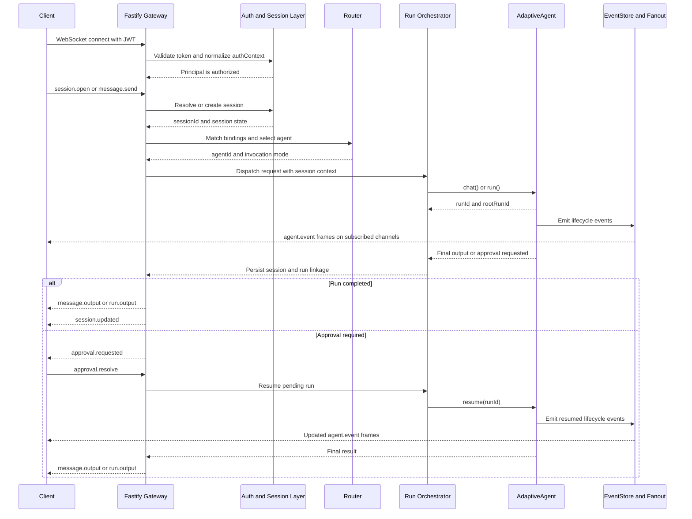

# AdaptiveAgent Gateway Diagrams

These diagrams are derived from [adaptive-agent-gateway-proposal.md](file:///Users/ugmurthy/riding-amp/AgentSmith/adaptive-agent-gateway-proposal.md) and are intentionally presentation-oriented.

## 1. High-Level Architecture

```mermaid
flowchart LR
    Client[Authenticated WebSocket Clients]

    subgraph Gateway[AdaptiveAgent Gateway]
        WS[Fastify WebSocket Server]
        Auth[Auth and Session Layer]
        Route[Deterministic Router]
        Orchestrator[Run Orchestrator]
        Fanout[Event Fanout]
    end

    subgraph Config[Configuration and Extensions]
        GatewayConfig[gateway.json]
        AgentConfig[agent configs]
        Modules[hooks, tools, auth modules]
    end

    subgraph Runtime[@adaptive-agent/core]
        Agent[AdaptiveAgent]
        Runs[Root Runs and Child Runs]
        Events[EventStore]
    end

    subgraph Storage[Persistence]
        SessionStore[Gateway session and transcript store]
        RunStore[Runtime run store]
    end

    Client -->|connect and send frames| WS
    WS --> Auth
    Auth -->|resolve or create session| Route
    Route -->|select configured agent| Orchestrator
    GatewayConfig --> Route
    AgentConfig --> Orchestrator
    Modules --> Orchestrator
    Orchestrator -->|chat(), run(), resume()| Agent
    Agent --> Runs
    Agent --> Events
    Auth --> SessionStore
    Orchestrator --> SessionStore
    Runs --> RunStore
    Events --> Fanout
    Fanout -->|session, run, root-run, agent channels| Client
```

## 2. Runtime Sequence


