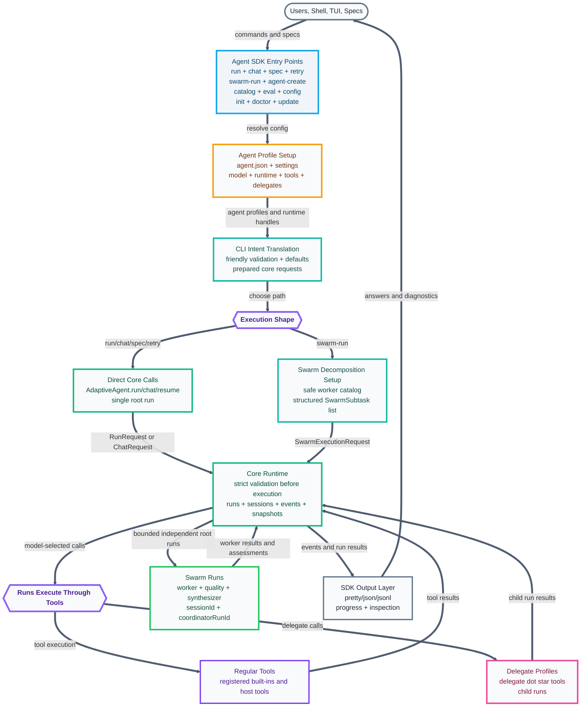
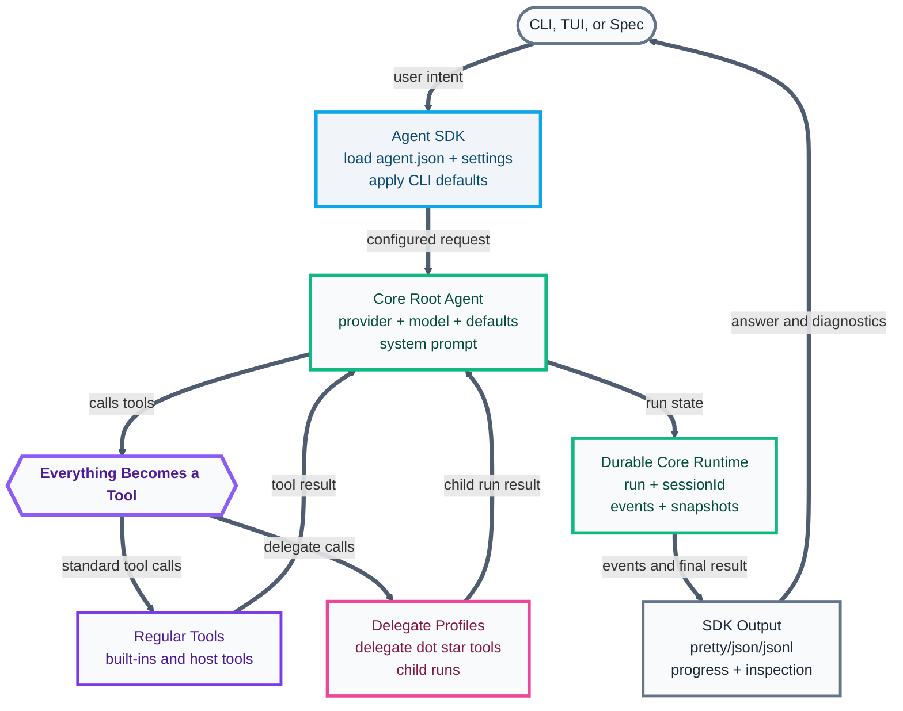

# AdaptiveAgent Agent SDK Diagram

This diagram is derived from [packages/agent-sdk/README.md](file:///Users/ugmurthy/riding-amp/AgentSmith/packages/agent-sdk/README.md) and [CORE-SESSION-SWARM-SPEC.md](file:///Users/ugmurthy/riding-amp/AgentSmith/CORE-SESSION-SWARM-SPEC.md). It is intentionally presentation-oriented.

## 0. Executive View: CLI Setup, Durable Core

**Caption:** The Agent SDK resolves local agent profiles and user intent, then hands prepared requests to core; core owns validation, durable runs, sessions, tools, events, snapshots, and swarm execution semantics.

### Simplified View: SDK-Prepared Core Root Agent

**Caption:** The Agent SDK turns local configuration and CLI input into a configured core root agent; the root agent runs through the core tool interface and returns events/results to the SDK output layer.

### Core Idea

The central idea in `@adaptive-agent/agent-sdk` is that CLI and TUI workflows are setup layers over `@adaptive-agent/core`. The SDK loads `agent.json` and `agent.settings.json`, resolves model/runtime/tool/delegate configuration, applies CLI-friendly defaults, and translates commands or specs into strict core requests.

The SDK also owns agent-profile creation workflows such as `agent-create`, which generates and writes new agent config JSON files before those profiles are used to configure core root agents.

For `swarm-run`, the SDK also owns the user-facing decomposition setup: it loads coordinator, worker, quality, and synthesizer agent profiles, builds a safe worker catalog summary, asks the coordinator for structured `SwarmSubtask[]`, and prevalidates the result for clear errors. Core still validates before execution and owns the durable run/session behavior.

### Why This Matters

- The SDK stays user-facing. Command names, config lookup, agent discovery, agent creation, dry runs, output formatting, progress, inspection, and friendly errors live close to the CLI/TUI.
- The core stays reusable. It does not depend on Agent SDK config paths, default agent specs, CLI commands, or agent-profile loading.
- Validation stays layered. The SDK may prevalidate for usability, but core still validates model output and execution requests before running them.
- Runtime semantics stay durable. Core owns runs, sessions, child runs, retries, continuation, snapshots, eventing, and runtime metadata.
- Swarm execution stays correlated. Worker, quality, and synthesizer runs are independent root runs grouped by `sessionId` and `coordinatorRunId`, not parallel child runs.
