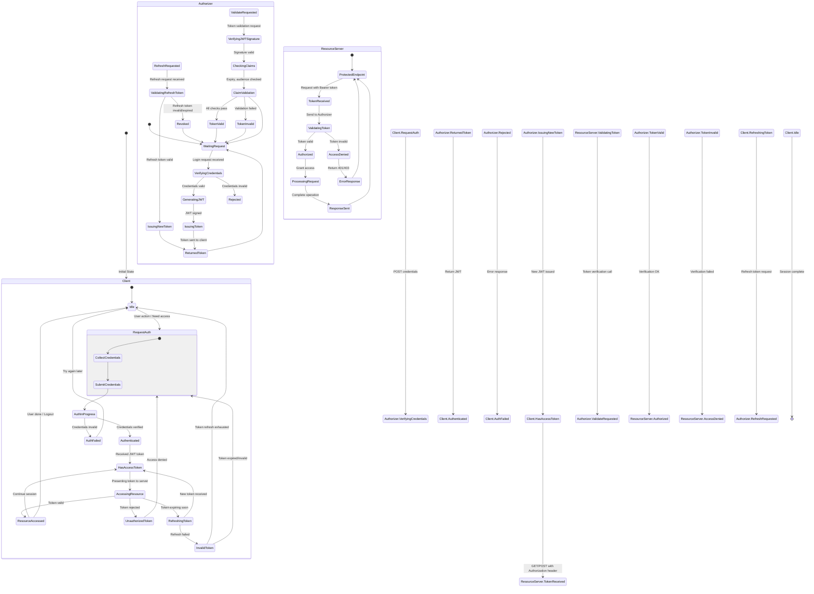

# Authentication Flow with JWT - State Diagram

This diagram depicts a typical JWT-based authentication flow involving:
- **Client**: The application requesting access
- **Authorizer** (Authorization Server): Third-party service that authenticates and issues JWTs
- **Resource Server**: The protected API/service being accessed

## Legend

| Component | Description |
|-----------|-------------|
| **Client** | Application making authenticated requests |
| **Authorizer** | Third-party Authorization Server (OAuth2/OIDC provider) |
| **Resource Server** | Protected API endpoint requiring authentication |

## Key JWT States Explained

1. **Idle → RequestAuth**: User initiates login or app needs access
2. **VerifyingCredentials**: Authorizer validates username/password or other credentials
3. **GeneratingJWT**: Authorizer creates signed JWT with claims (subject, issuer, expiry, scope)
4. **HasAccessToken**: Client stores JWT (typically in secure storage/localStorage)
5. **AccessingResource**: Client includes `Authorization: Bearer <JWT>` header
6. **ValidatingToken**: Resource server verifies JWT signature and claims
7. **RefreshingToken**: Client uses refresh token before access token expires
8. **TokenInvalid/Revoked**: Token expired, tampered, or revoked

## Security Notes

- **Access tokens** are short-lived (minutes to hours)
- **Refresh tokens** allow obtaining new access tokens without re-authentication
- Always verify: **signature**, **issuer (iss)**, **audience (aud)**, **expiration (exp)**, **not-before (nbf)**
- Use HTTPS for all token transmissions
